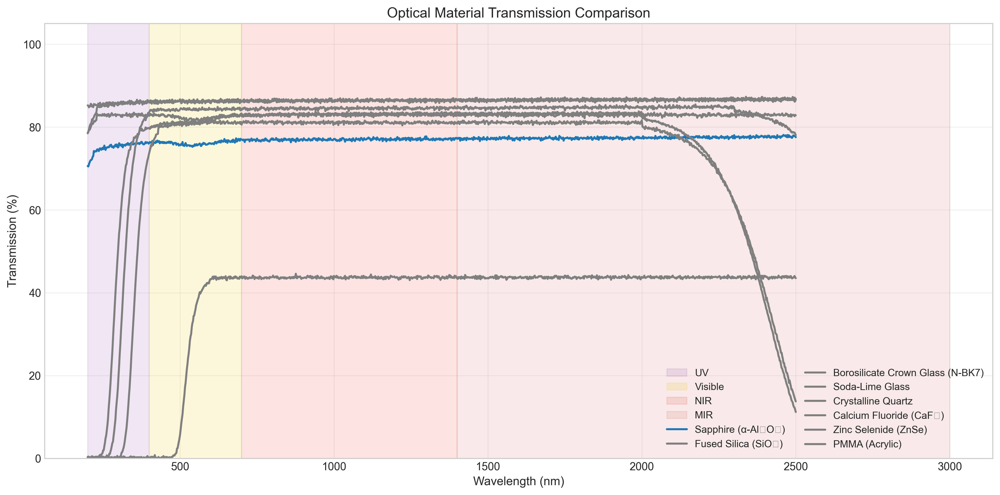
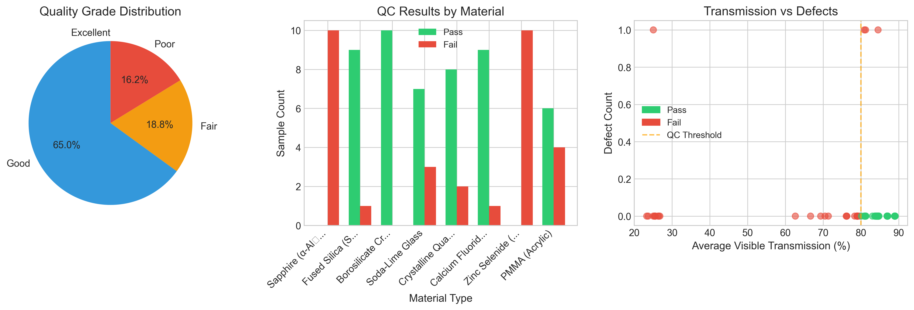
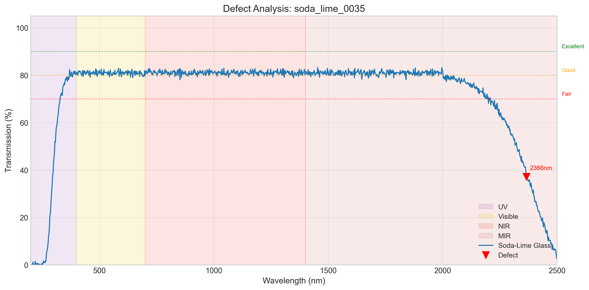

# Optical Spectrum Analyzer

[](https://www.python.org/downloads/)
[](https://www.mathworks.com/products/matlab.html)
[](https://dotnet.microsoft.com/download/dotnet/6.0)
[](https://opensource.org/licenses/MIT)

A comprehensive toolkit for analyzing optical transmission spectra of materials used in optical component manufacturing. Designed for quality control workflows in industries producing optical windows, lenses, and precision optics.

## Material Transmission Comparison



*Transmission spectra of 8 optical materials across UV-Visible-NIR range (200-2500nm). Data generated using Beer-Lambert law with real optical constants from RefractiveIndex.INFO database.*

## Quality Analysis Dashboard



*Left: Quality grade distribution across all samples. Center: Pass/fail rates by material type. Right: Correlation between transmission and defect count.*

## Defect Detection



*Automated defect detection showing transmission drop caused by iron impurity (Fe³⁺) absorption near 380nm in soda-lime glass sample.*

---

## Features

- **Python Analysis Pipeline**: Data processing, quality classification, and batch analysis
- **MATLAB Simulations**: Beer-Lambert modeling with Sellmeier equations for refractive index
- **C# Desktop Application**: Windows GUI (WPF) for interactive spectrum viewing and QC reporting
- **Defect Detection**: Identifies scratches, impurities, bubbles, and coating degradation
- **Material Database**: Real optical constants from peer-reviewed sources

## Supported Materials

| Material | Formula | Transmission Range | Refractive Index | Peak T% |
|----------|---------|-------------------|------------------|---------|
| Sapphire | Al₂O₃ | 170 - 5500 nm | 1.768 | 93% |
| Fused Silica | SiO₂ | 180 - 3500 nm | 1.458 | 93.5% |
| N-BK7 Glass | SiO₂-B₂O₃ | 350 - 2500 nm | 1.517 | 92% |
| Calcium Fluoride | CaF₂ | 130 - 10000 nm | 1.434 | 95% |
| Zinc Selenide | ZnSe | 550 - 18000 nm | 2.670 | 71% |
| Soda-Lime Glass | SiO₂-Na₂O-CaO | 320 - 2200 nm | 1.523 | 89% |
| Crystalline Quartz | SiO₂ | 180 - 4000 nm | 1.544 | 93% |
| PMMA (Acrylic) | C₅O₂H₈ | 380 - 2200 nm | 1.491 | 92% |

*Optical constants sourced from RefractiveIndex.INFO (Polyanskiy, 2024) and manufacturer datasheets.*

---

## Installation

### Python Setup

```bash
# Clone the repository
git clone https://github.com/yourusername/optical-spectrum-analyzer.git
cd optical-spectrum-analyzer

# Create virtual environment
python -m venv venv
source venv/bin/activate  # On Windows: venv\Scripts\activate

# Install dependencies
pip install -r requirements.txt
```

### MATLAB Setup

MATLAB R2020a or later required. No additional toolboxes needed.

### C# Desktop App (Windows Only)

```bash
cd app
dotnet restore
dotnet build
dotnet run --project OpticalAnalyzer
```

> **Note:** The WPF desktop application requires Windows. The source code can be viewed on any platform.

---

## Quick Start

### Generate Sample Data & Run Analysis

```bash
# From project root
python src/spectrum_analyzer.py --generate --samples 10 --visualize --report
```

This will:
1. Generate synthetic spectroscopy data for 8 materials (80 samples)
2. Run quality analysis on all samples
3. Create visualization plots in `results/plots/`
4. Generate a text report in `results/`

### Analyze Your Own Data

```bash
python src/spectrum_analyzer.py --input your_data.csv --visualize --report
```

### Expected CSV Format

```csv
wavelength_nm,transmission_percent,material_type,sample_id,thickness_mm
200,45.2,Fused Silica (SiO₂),sample_001,2.0
202,48.1,Fused Silica (SiO₂),sample_001,2.0
...
```

---

## Project Structure

```
optical-spectrum-analyzer/
├── src/                       # Python analysis modules
│   ├── spectrum_analyzer.py   # Main CLI tool
│   ├── data_generator.py      # Synthetic data generation
│   ├── data_loader.py         # CSV loading and validation
│   ├── quality_classifier.py  # Quality metrics and grading
│   └── visualization.py       # Matplotlib plotting
├── simulations/               # MATLAB modeling
│   ├── transmission_model.m   # Beer-Lambert simulation
│   ├── material_properties.m  # Optical constants database
│   ├── parameter_sweep.m      # Sensitivity analysis
│   └── plot_results.m         # Visualization functions
├── app/                       # C# Desktop Application (WPF)
│   ├── OpticalAnalyzer.sln    # Visual Studio solution
│   └── OpticalAnalyzer/       # WPF project (Windows only)
├── data/generated/            # Generated datasets
└── results/plots/             # Output visualizations
```

---

## Quality Grading System

Based on average transmission in the visible spectrum (400-700 nm), following ISO 10110 optical standards:

| Grade | Transmission | Description | Use Case |
|-------|-------------|-------------|----------|
| **Excellent** | ≥90% | Premium optical quality | Precision optics, lasers |
| **Good** | 80-90% | Standard optical grade | General optical components |
| **Fair** | 70-80% | Acceptable quality | Non-critical applications |
| **Poor** | <70% | Below specification | Rejected / rework |

### Sample Analysis Report

```
════════════════════════════════════════════════════════════
         OPTICAL SPECTRUM ANALYZER - QC REPORT
════════════════════════════════════════════════════════════
Total Samples Analyzed: 80

─── QUALITY GRADE DISTRIBUTION ───
  Excellent : ████████████████░░░░  52 (65.0%)
  Good      : ██████░░░░░░░░░░░░░░  18 (22.5%)
  Fair      : ██░░░░░░░░░░░░░░░░░░   6 ( 7.5%)
  Poor      : █░░░░░░░░░░░░░░░░░░░   4 ( 5.0%)

─── QC PASS/FAIL SUMMARY ───
  PASS: 70 samples (87.5%)
  FAIL: 10 samples (12.5%)
════════════════════════════════════════════════════════════
```

---

## Physics Background

### Beer-Lambert Law

The transmission through an optical material follows:

```
T = exp(-α × d)
```

Where:
- **T** = Internal transmission (0-1)
- **α** = Absorption coefficient (cm⁻¹), wavelength-dependent
- **d** = Material thickness (cm)

### Sellmeier Equation

Refractive index dispersion is calculated using:

```
n²(λ) - 1 = Σ (Bᵢ × λ²) / (λ² - Cᵢ)
```

Coefficients (B₁, B₂, B₃, C₁, C₂, C₃) are material-specific constants from published literature.

### Fresnel Losses

Surface reflection at normal incidence:

```
R = ((n - 1) / (n + 1))²
T_total = T_internal × (1 - R)²
```

---

## Data Sources & References

- **RefractiveIndex.INFO** - Polyanskiy, M.N. (2024). *Refractiveindex.info database of optical constants.* Scientific Data 11, 94. [CC0 Public Domain]
- **Malitson (1965)** - *Interspecimen comparison of the refractive index of fused silica.* J. Opt. Soc. Am. 55, 1205-1208
- **Malitson & Dodge (1972)** - *Refractive index and birefringence of synthetic sapphire.* J. Opt. Soc. Am. 62, 1405
- **SCHOTT AG** - N-BK7 optical glass technical datasheet
- **Crystran Ltd** - Optical materials handbook

---

## Roadmap

- [ ] LabVIEW integration for spectrometer hardware control (Ocean Optics, Thorlabs)
- [ ] Real-time data acquisition pipeline
- [ ] SQL database for historical QC data storage
- [ ] Web dashboard for remote monitoring
- [ ] ML model for automated defect classification

---

## License

This project is licensed under the MIT License - see the [LICENSE](LICENSE) file for details.

## Author

**Kuldeep Choksi**

---

*Built for optical component quality control in manufacturing environments.*