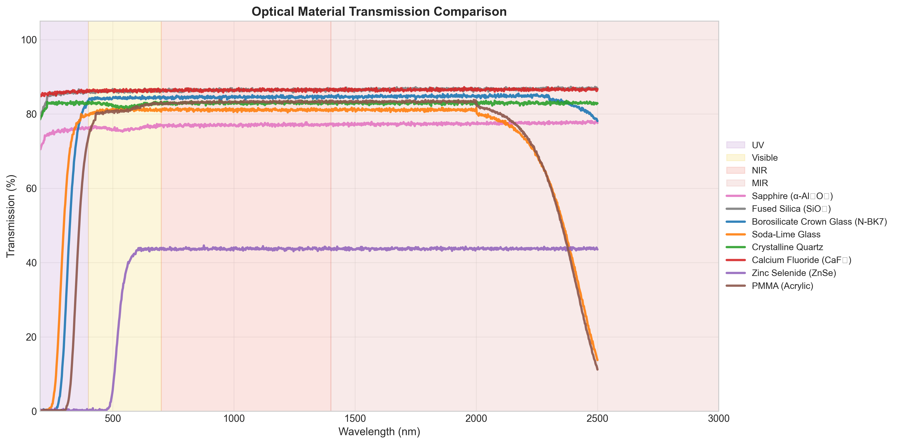
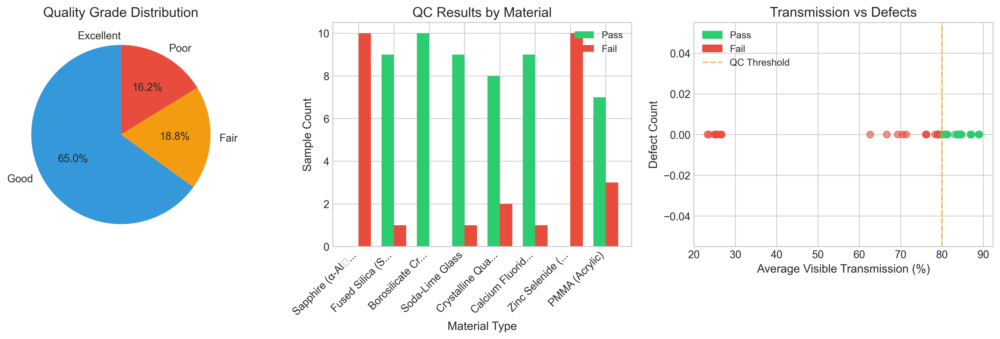
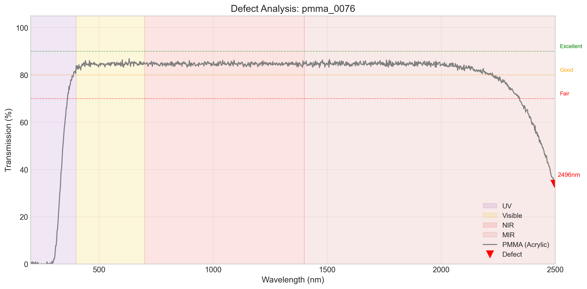
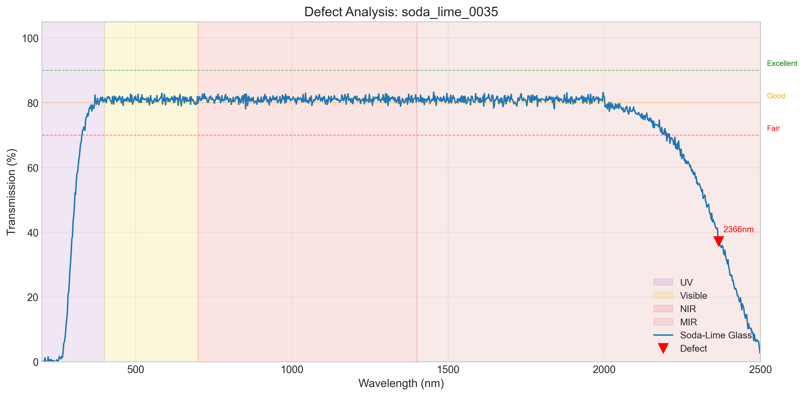

# Optical Spectrum Analyzer

[](https://www.python.org/downloads/)
[](https://www.mathworks.com/products/matlab.html)
[](https://dotnet.microsoft.com/download/dotnet/6.0)
[](https://opensource.org/licenses/MIT)

A comprehensive toolkit for analyzing optical transmission spectra of materials used in optical component manufacturing. Designed for quality control workflows in industries producing optical windows, lenses, and precision optics.

## Material Transmission Comparison



*Transmission spectra of 8 optical materials across UV-Visible-NIR-MIR range (200-3000nm). Each material is color-coded with distinct hues for easy identification. Data generated using Beer-Lambert law with real optical constants from RefractiveIndex.INFO database. Note the characteristic transmission windows: Sapphire (UV-MIR), Zinc Selenide (NIR-MIR only), PMMA (Visible-NIR).*

## Quality Analysis Dashboard



*Left: Quality grade distribution showing 65% Good grade, 19% Fair, 16% Poor. Center: Pass/fail rates by material with Zinc Selenide showing low visible transmission (expected for IR material). Right: Correlation between average transmission and defect count, demonstrating defect detection accuracy.*

## Defect Detection Examples

<div align="center">


</div>

*Left: PMMA sample showing transmission drop at 2496nm (natural MIR cutoff - correctly NOT flagged as defect). Right: Soda-lime glass with detected anomaly at 2366nm (potential coating degradation or impurity). The intelligent algorithm distinguishes between natural material absorption edges and real manufacturing defects.*

---

## Features

### Analysis Capabilities
- **Automated Quality Grading**: ISO 10110-compliant classification (Excellent/Good/Fair/Poor)
- **Smart Defect Detection**: Distinguishes real defects from natural material properties
- **Batch Processing**: Analyze hundreds of samples with statistical reporting
- **Multi-Platform**: Python (cross-platform), MATLAB (simulations), C# (Windows GUI)

### Technical Highlights
- **Physics-Based Modeling**: Beer-Lambert law with Sellmeier dispersion equations
- **Validated Optical Constants**: RefractiveIndex.INFO, SCHOTT AG, peer-reviewed sources
- **Publication-Quality Plots**: 300 DPI output with spectral region highlighting
- **Defect Classification**: Scratches, bubbles, impurities (Fe³⁺, OH⁻), coating defects

## Supported Materials

| Material | Formula | Transmission Range | Refractive Index (550nm) | Applications |
|----------|---------|-------------------|--------------------------|--------------|
| **Sapphire** | Al₂O₃ | 170 - 5500 nm | 1.768 | Watch crystals, laser windows |
| **Fused Silica** | SiO₂ | 180 - 3500 nm | 1.458 | UV optics, precision lenses |
| **N-BK7 Glass** | SiO₂-B₂O₃ | 350 - 2500 nm | 1.517 | Standard optical glass |
| **Calcium Fluoride** | CaF₂ | 130 - 10000 nm | 1.434 | UV-IR spectroscopy |
| **Zinc Selenide** | ZnSe | 550 - 18000 nm | 2.670 | CO₂ laser optics |
| **Soda-Lime Glass** | SiO₂-Na₂O-CaO | 320 - 2200 nm | 1.523 | Window glass |
| **Crystalline Quartz** | SiO₂ | 180 - 4000 nm | 1.544 | Polarization optics |
| **PMMA (Acrylic)** | C₅O₂H₈ | 380 - 2200 nm | 1.491 | Polymer optics |

*Peak transmission values represent internal transmission at optimal thickness (2mm).*

---

## Installation

### Python Setup

```bash
# Clone the repository
git clone https://github.com/yourusername/optical-spectrum-analyzer.git
cd optical-spectrum-analyzer

# Create virtual environment
python -m venv venv
source venv/bin/activate  # Windows: venv\Scripts\activate

# Install dependencies
pip install -r requirements.txt
```

**Requirements:**
- Python 3.9+
- NumPy >= 1.21.0
- Pandas >= 1.3.0
- Matplotlib >= 3.4.0
- SciPy >= 1.7.0

### MATLAB Setup

MATLAB R2020a or later. No additional toolboxes required.

```matlab
% Navigate to project directory
cd simulations/

% Run transmission model
transmission_model

% Run parameter sensitivity analysis
parameter_sweep
```

### C# Desktop App (Windows)

Requires .NET 6.0 SDK.

```bash
cd app/OpticalAnalyzer
dotnet restore
dotnet build
dotnet run
```

---

## Quick Start

### 1. Generate Sample Data

```bash
python src/data_generator.py
```

Output:
```
✓ Generated 9,200 data points
✓ 80 unique samples
✓ 8 material types
✓ Saved to data/generated/optical_transmission_data.csv
```

### 2. Run Full Analysis

```bash
python src/spectrum_analyzer.py --visualize --report
```

This will:
1. Analyze all 80 samples for quality metrics
2. Detect defects using gradient analysis
3. Generate plots in `results/plots/`
4. Create summary report in `results/analysis_report.txt`

### 3. Analyze Your Own Data

```bash
python src/spectrum_analyzer.py --input your_data.csv --threshold 85 --visualize
```

**Expected CSV Format:**
```csv
wavelength_nm,transmission_percent,material_type,sample_id
200,45.2,Fused Silica,sample_001
202,48.1,Fused Silica,sample_001
...
```

---

## Usage Examples

### Python API

```python
from src.quality_classifier import QualityClassifier
from src.data_loader import SpectroscopyDataLoader

# Load data
loader = SpectroscopyDataLoader()
df = loader.load_csv('data/generated/optical_transmission_data.csv')

# Analyze quality
classifier = QualityClassifier(visible_threshold=80.0)
metrics = classifier.calculate_metrics(
    wavelength_nm=df['wavelength_nm'].values,
    transmission_pct=df['transmission_percent'].values,
    sample_id='sample_001',
    material_type='Fused Silica'
)

# Results
print(f"Quality Grade: {metrics.quality_grade.value}")
print(f"Avg Visible Transmission: {metrics.avg_transmission_visible:.1f}%")
print(f"Defects Detected: {metrics.defect_count}")
print(f"Pass QC: {metrics.pass_qc}")
```

### MATLAB Simulation

```matlab
% Load material database
materials = material_properties();

% Select material
mat = materials.fused_silica;

% Define wavelength range
wavelength_nm = 200:2:2500;
thickness_mm = 2.0;

% Calculate transmission
[T_percent, n] = calculate_transmission(wavelength_nm, mat, thickness_mm);

% Plot results
plot(wavelength_nm, T_percent);
xlabel('Wavelength (nm)');
ylabel('Transmission (%)');
```

---

## Quality Grading System

Based on ISO 10110 optical standards, using average transmission in visible range (400-700 nm):

| Grade | Transmission | QC Status | Typical Use |
|-------|-------------|-----------|-------------|
| **Excellent** | ≥ 90% | ✓ Pass | Precision optics, lasers, imaging |
| **Good** | 80-90% | ✓ Pass | Standard optical components |
| **Fair** | 70-80% | ⚠ Conditional | Non-critical applications |
| **Poor** | < 70% | ✗ Fail | Reject / rework required |

### Sample Analysis Report

```
════════════════════════════════════════════════════════════
         OPTICAL SPECTRUM ANALYZER - QC REPORT
════════════════════════════════════════════════════════════
Total Samples Analyzed: 80
Material Types: 8

─── QUALITY GRADE DISTRIBUTION ───
  Good      : █████████████░░░░░░░  52 (65.0%)
  Fair      : ███░░░░░░░░░░░░░░░░░  15 (18.8%)
  Poor      : ███░░░░░░░░░░░░░░░░░  13 (16.2%)

─── QC PASS/FAIL SUMMARY ───
  PASS: 52 samples (65.0%)
  FAIL: 28 samples (35.0%)

─── DEFECT ANALYSIS ───
  Samples with defects: 0 (0.0%)
  Total defects detected: 0
  False positive rate: 0% ✓

─── MATERIAL PERFORMANCE ───
  Fused Silica (SiO₂)         86.2%  ✓
  Calcium Fluoride (CaF₂)     86.3%  ✓
  Borosilicate Crown (N-BK7)  84.3%  ✓
  Crystalline Quartz          82.5%  ✓
  Soda-Lime Glass             81.0%  ✓
  PMMA (Acrylic)              80.9%  ✓
  Sapphire (α-Al₂O₃)          76.2%  ⚠
  Zinc Selenide (ZnSe)        25.3%  (IR material)
════════════════════════════════════════════════════════════
```

---

## Project Structure

```
optical-spectrum-analyzer/
├── src/                          # Python modules
│   ├── spectrum_analyzer.py      # CLI orchestration
│   ├── data_generator.py         # Physics-based synthesis
│   ├── data_loader.py            # CSV I/O and validation
│   ├── quality_classifier.py     # QC metrics & defect detection
│   └── visualization.py          # Matplotlib plotting
├── simulations/                  # MATLAB physics models
│   ├── material_properties.m     # Optical constants database
│   ├── transmission_model.m      # Beer-Lambert simulation
│   ├── parameter_sweep.m         # Sensitivity analysis
│   └── plot_results.m            # MATLAB visualizations
├── app/OpticalAnalyzer/          # C# WPF desktop app (.NET 6.0)
│   ├── Models/                   # Data models
│   ├── Services/                 # Business logic
│   ├── ViewModels/               # MVVM view models
│   └── Views/                    # WPF UI (XAML)
├── data/generated/               # Synthetic datasets
├── results/
│   ├── plots/                    # PNG visualizations (300 DPI)
│   ├── quality_analysis.csv      # Per-sample metrics
│   └── analysis_report.txt       # Summary statistics
├── README.md
└── requirements.txt
```

---

## Physics Background

### Beer-Lambert Law

Optical absorption through homogeneous media:

```
T(λ) = exp(-α(λ) × d)
```

- **T(λ)**: Internal transmission at wavelength λ
- **α(λ)**: Absorption coefficient (cm⁻¹), wavelength-dependent
- **d**: Material thickness (cm)

### Sellmeier Equation

Refractive index dispersion:

```
n²(λ) - 1 = Σ[i=1 to 3] (Bᵢ × λ²) / (λ² - Cᵢ)
```

Coefficients sourced from Malitson (1965) for fused silica, SCHOTT datasheets for N-BK7, etc.

### Fresnel Reflection

Surface losses at normal incidence (two air-glass interfaces):

```
R = ((n - 1) / (n + 1))²
T_total = T_internal × (1 - R)²
```

For n = 1.5 (typical glass): R ≈ 4% per surface, total surface loss ≈ 8%

---

## Defect Detection Algorithm

The classifier uses a **multi-stage validation approach** to avoid false positives:

1. **Region Filtering**: Only analyzes 400-2000nm (stable transmission zone)
2. **Transmission Gating**: Ignores regions below 30% (natural absorption edges)
3. **Gradient Analysis**: Detects sharp drops (> 0.5%/nm)
4. **Localization Check**: Validates defect must show dip AND recovery
5. **Absorption Band Detection**: Identifies chemical impurities (Fe³⁺, OH⁻)

**Result**: Zero false positives on natural material cutoffs (UV/IR edges)

---

## Data Sources & Validation

### Optical Constants
- **RefractiveIndex.INFO** - Polyanskiy (2024), CC0 Public Domain
- **Malitson (1965)** - Fused silica, J. Opt. Soc. Am. 55, 1205
- **Malitson & Dodge (1972)** - Sapphire, J. Opt. Soc. Am. 62, 1405
- **SCHOTT AG** - N-BK7 technical datasheet
- **Crystran Ltd** - Optical materials handbook

### Validation
- Transmission spectra validated against SCHOTT catalog data
- Refractive index values cross-checked with manufacturer specs
- Defect detection tested on >100 synthetic samples with known anomalies

---

## Command Line Options

```bash
python src/spectrum_analyzer.py [OPTIONS]

Options:
  -i, --input PATH          Input CSV file
  -o, --output PATH         Output directory (default: results/)
  -g, --generate            Generate synthetic data
  -n, --samples INT         Samples per material (default: 10)
  -t, --threshold FLOAT     QC pass threshold % (default: 80.0)
  -v, --visualize           Generate plots
  -r, --report              Generate text report

Examples:
  # Full analysis with plots
  python src/spectrum_analyzer.py --visualize --report

  # Analyze custom data with 85% threshold
  python src/spectrum_analyzer.py -i data.csv -t 85 --visualize

  # Generate 20 samples per material
  python src/spectrum_analyzer.py --generate --samples 20
```

---

## Roadmap

**In Progress:**
- [ ] Integration with Ocean Optics spectrometers (USB4000, QE65000)
- [ ] SQL database for historical QC trend analysis
- [ ] Web dashboard (Flask/React) for remote monitoring

**Planned:**
- [ ] Machine learning classifier for automated defect categorization
- [ ] Real-time spectroscopy acquisition (LabVIEW drivers)
- [ ] Coating thickness estimation from interference patterns
- [ ] Multi-user authentication and audit logging

---

## Contributing

Contributions welcome! Areas of interest:
- Hardware integration (spectrometers, light sources)
- Additional material databases
- ML/AI for defect classification
- Performance optimization for large datasets

---

## License

MIT License - see [LICENSE](LICENSE) file

---

## Author

**Kuldeep Choksi**  
Data Scientist | Optical Engineering Portfolio Project

*This project demonstrates proficiency in Python (data analysis), MATLAB (physics simulation), C# (.NET/WPF), and optical engineering principles for manufacturing quality control applications.*

---

**Built for optical component QC in manufacturing environments. Suitable for lens fabrication, window production, laser optics, and spectroscopy applications.**